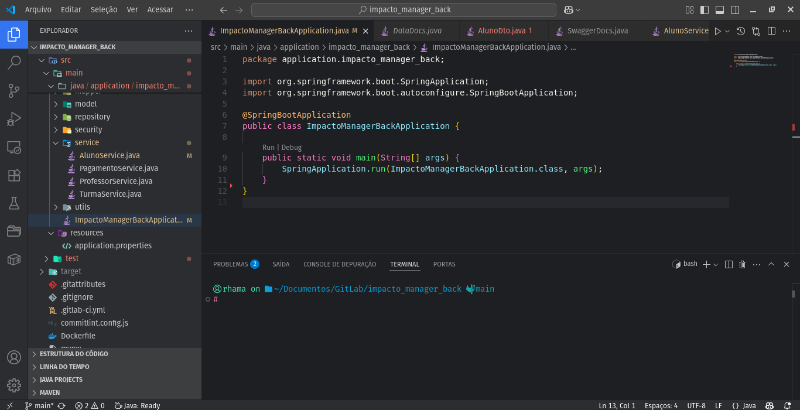
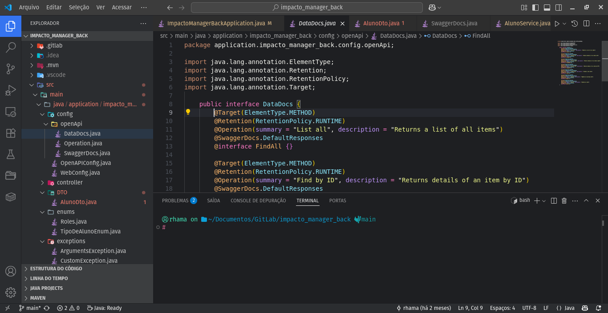
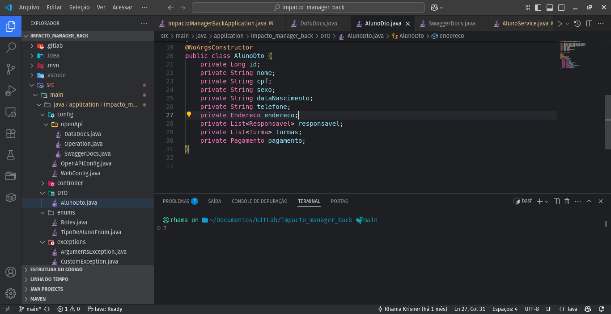
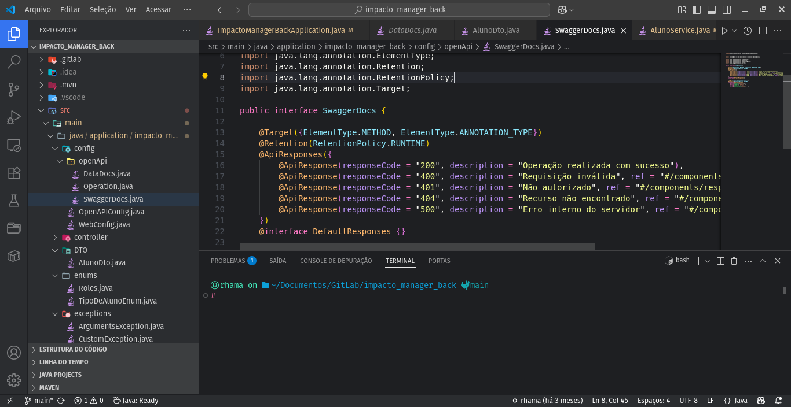
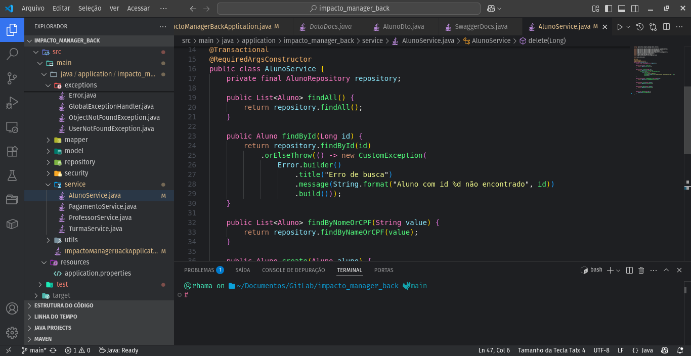
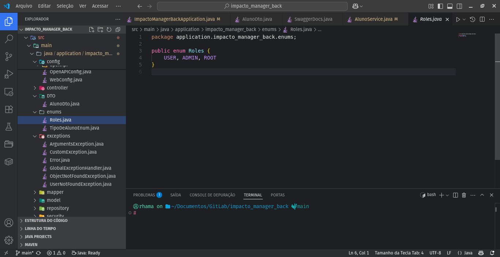

# IntelliJ Color Theme Packs

🎨 A collection of IntelliJ-style color themes for Visual Studio Code — including both official JetBrains themes and unique plugin-based variants not available elsewhere.

## ✨ About

This extension brings the visual elegance of IntelliJ IDEA themes to VS Code — not only the classic styles, but also rare and community-loved themes that exist only as IntelliJ plugins. Expect soft palettes, balanced contrast, and a sleek, modern feel that enhances productivity.

Perfect for developers transitioning from IntelliJ or anyone who enjoys a curated and expanded theme collection beyond the basics.

## 📦 Includes

- Dark and light themes¹ inspired by official JetBrains themes and exclusive IntelliJ plugin themes  
- Syntax highlighting support for Java, Kotlin, TypeScript, JavaScript, HTML, CSS, and more  
- Matching UI and editor styles, adapted to resemble the JetBrains experience

---

¹ Light themes and more variants are coming in future updates.

## 🖼️ Screenshots

> Coming soon — preview screenshots with real-world code examples using the included themes.

## 🚀 Installation

1. Visit the [Visual Studio Marketplace](https://marketplace.visualstudio.com/) (link will be added after publishing).
2. Search for `IntelliJ Color Theme Packs`.
3. Click **Install**.
4. Open the VS Code Command Palette (`Ctrl+Shift+P`) and select:  
   `Preferences: Color Theme` → Choose your favorite IntelliJ-style theme.

## 🔧 Recommended Extensions

If you're looking to tweak or create your own themes based on these, here are some useful tools:

- [Atom Material Icons](https://marketplace.visualstudio.com/items?itemName=AtomMaterial.a-file-icon-vscode) — Atom Material Icons Plugin for VSCode

